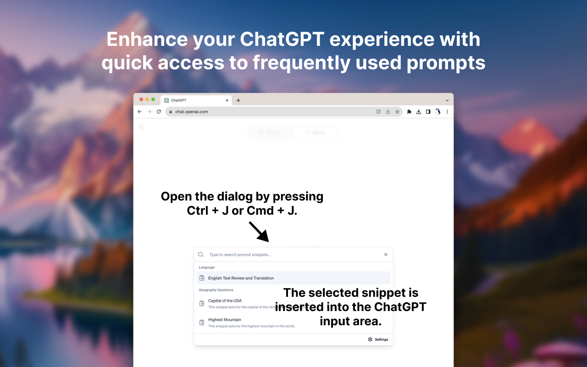
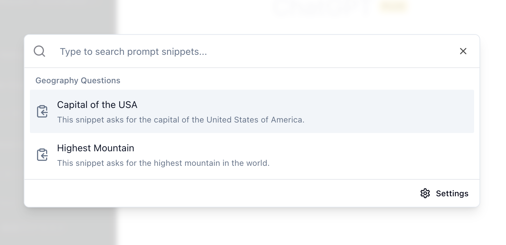

# ChatGPT Prompt Snippets

ChatGPT Prompt Snippets is a Google Chrome Extension that helps you manage and utilize prompt snippets conveniently when using ChatGPT.
It provides a dialog interface where you can search and select prompt snippets to be inserted into the input area of ChatGPT.



You can install the extension from the [Chrome Web Store](https://chrome.google.com/webstore/detail/chatgpt-prompt-snippets/ilcndgnlkiodbcpcgjkfihjponbenmem).

## Motivation

ChatGPT is a powerful tool, but sometimes composing the right prompt can be time-consuming.
This is especially true during day-to-day work when you find yourself using similar prompts repeatedly.
Typing out the same prompts over and over again can become a hassle.
This extension was created to streamline the process of crafting prompts by providing a convenient Chrome Extension that lets you quickly access and use your frequently used snippets.

## How to Use

1. Install the Chrome Extension from the [Chrome Web Store](https://chrome.google.com/webstore/detail/chatgpt-prompt-snippets/ilcndgnlkiodbcpcgjkfihjponbenmem).
1. Open ChatGPT at https://chat.openai.com/.
1. Open the extension's dialog by pressing Ctrl + J or Cmd + J.
1. Click the "Settings" button in the dialog to configure your snippets. See [Configuration](#configuration) for more details.
1. Type to search for a snippet or select one from the list of snippets. 
1. The selected snippet will be inserted into the ChatGPT input area.

## Configuration

To create snippets, you will need to write your configurations in Markdown format. 
The combination of headings at level 1 (`#`) and level 2 (`##`), paragraphs, and code blocks will define your snippets.
Here's how you can set it up:

- Use a level 1 heading (`#`) to define a snippet group.
- Use a level 2 heading (`##`) to define a snippet name.
- Write a paragraph below the snippet name to provide a description.
- Include a code block to define the snippet.

Here's an example of how you can configure your snippets:

````markdown
# Geography Questions

## Capital of the USA

This snippet asks for the capital of the United States of America.

```
What is the capital of the United States of America?
```

## Highest Mountain

This snippet asks for the highest mountain in the world.

```
What is the highest mountain in the world?
```
````

In this example, there is a "Geography Questions" group that contains a snippet called "Capital of the USA".
This snippet will copy the text "What is the capital of the United States of America?" into ChatGPT's input area.
Additionally, there is a "Highest Mountain" snippet that will copy the text "What is the highest mountain in the world?" into the input area.

With this configuration, you can show the following dialog by pressing Ctrl + J or Cmd + J:



## Author

Kohki Makimoto <kohki.makimoto@gmail.com>

## License

The MIT License (MIT)
